# Lingo

Türkçe kelime tahmin oyunu. Kelimenin ilk harfi baştan açık gelir, geri kalanını altı denemede bulmaya çalışırsın. Her tahminden sonra harfler renklenir ve seni doğru kelimeye yaklaştırır. Oyun bitince kelimenin anlamı gösterilir.

  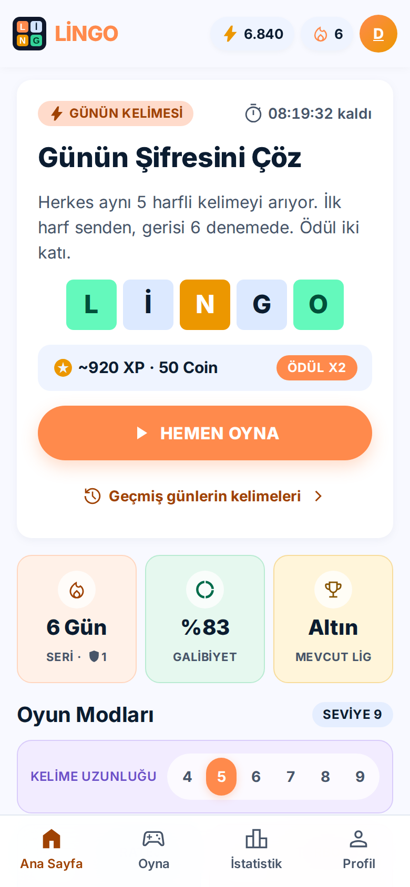
  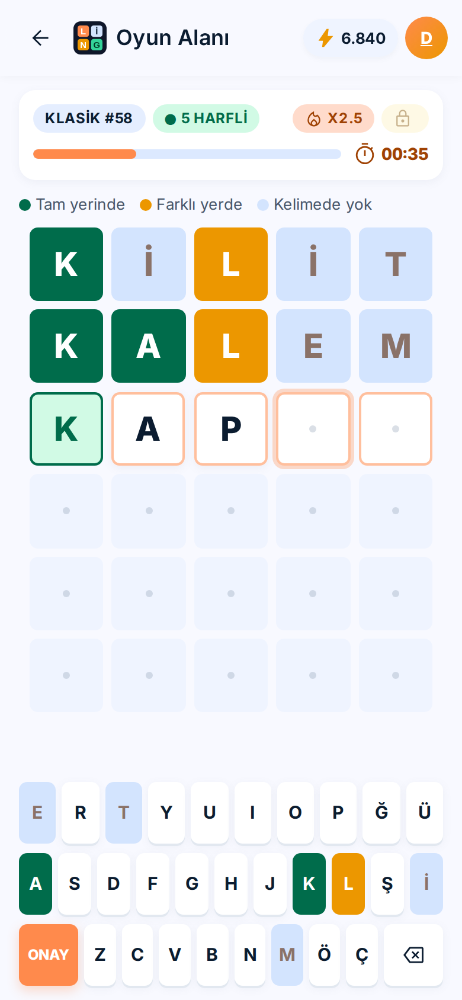
  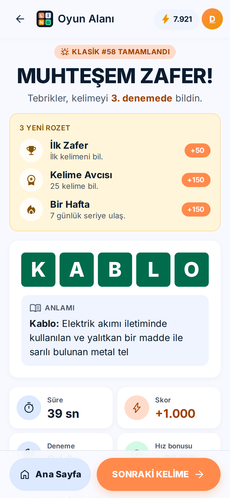

## Nasıl oynanır

1. Ana sayfada kelime uzunluğunu seç: 4 ile 9 harf arası.
2. Bir oyun modu seç. Tahtanın ilk satırında kelimenin ilk harfi hazır bekler.
3. Kalan harfleri yazıp **ONAY**'a bas. Tahmin, sözlükte bulunan gerçek bir kelime olmalı.
4. Harflerin rengine bak:
   - **Yeşil:** harf doğru yerde.
   - **Turuncu:** harf kelimede var ama başka yerde.
   - **Mavi-gri:** harf kelimede yok.
5. Doğru yerini bulduğun harfler bir sonraki satırda soluk olarak gösterilir. Altı denemede kelimeyi bulursan kazanırsın.

İlk açılışta senden bir oyuncu adı istenir. Adını her 10 oyunda bir ücretsiz değiştirebilirsin; beklemek istemezsen 1000 coin ödersin. Oyun sesleri ve tuşlardaki titreşim Profil sayfasındaki Ayarlar bölümünden açılıp kapatılır.

Takıldığında ampul simgesine basıp bir harf açtırabilirsin. İpucu 4. tahminde açılır ve bir kelimede en fazla 3 kez kullanılır; ilki bedava, sonrakiler oyunda kazandığın coin'lerle alınır. Bilinmeyen son harf ipucuyla açılmaz, onu her zaman sen bulursun.

## Oyun modları

**Günün Kelimesi.** Herkes aynı gün aynı 5 harfli kelimeyi arar. Kelime gece yarısı değişir, ödülü iki katıdır.

**Klasik.** Seçtiğin uzunlukta rastgele bir kelime, süre sınırı yok. Oyunu yarıda bırakırsan kaydedilir. Tekrar açtığında devam etmek mi yoksa yeni oyun mu istediğin sorulur.

**Zamana Karşı.** 60 saniyede bilebildiğin kadar kelime bil. Bir kelimeyi bulunca ya da altı hakkın bitince hemen yenisi gelir.

**Arşiv.** Kaçırdığın son 60 günün kelimelerini ana sayfadaki "Geçmiş günlerin kelimeleri" bağlantısından oynayabilirsin. Arşiv, o günün kelimesini tamamladıktan sonra açılır; böylece önce bugünü oynarsın. Arşivde yarım bıraktığın bir gün varsa, o bitmeden diğer günler açılmaz. Arşiv oyunları ödül kazandırır ama seriyi uzatmaz.

## Seri, rozetler ve ayarlar

**Seri koruyucu.** Günün kelimesini bildiğin her gün serin bir artar. Bir günü kaçırırsan seri sıfırlanır, ama elinde seri koruyucu varsa o gün kendiliğinden kapatılır. Koruyucuyu Profil sayfasındaki mağazadan 200 coin'e alırsın, en fazla 2 tane taşıyabilirsin.

**Rozetler.** İlk zafer, ilk denemede bilmek, 7 ve 30 günlük seri, 9 harfli kelime, zor modda galibiyet gibi 12 hedef var. Her rozet açıldığında coin ödülü verir. İlerlemeni İstatistikler sayfasındaki Rozetler bölümünden görebilirsin.

**Zor mod.** Açıkken, doğru yerde bulduğun harfleri yerinde tutman ve kelimede olduğunu öğrendiğin harfleri sonraki tahminlerde kullanman gerekir. Yeni başlayan oyunlarda geçerli olur.

**Günlük hatırlatma.** Android uygulamasında, günün kelimesini çözmediysen seçtiğin saatte bildirim gelir. Kelimeyi çözdüğün gün bildirim gönderilmez.

**Uzunluğa göre istatistik.** İstatistikler sayfasında sonuçlarını 4'ten 9'a her kelime uzunluğu için ayrı ayrı görebilirsin.

**Skor tablosu.** Günün kelimesini bitirdiğinde, istersen puanın diğer oyuncuların da gördüğü skor tablosuna eklenir. Bugün, bu hafta, bu ay ve tüm zamanlar listeleri var; haftalık, aylık ve tüm zamanlar puanı günlük puanların toplamıdır. Tabloda yalnızca oyuncu adın ve puanın görünür. Katılmak isteğe bağlıdır ve Profil sayfasından kapatılabilir. Puanı telefon değil sunucu hesaplar, bu yüzden sahte skor gönderilemez.

## Uygulama nasıl çalışıyor

**Kelimeler.** Tahmin ettiğin her kelime, TDK Güncel Türkçe Sözlük'teki 37.922 kelimeyle karşılaştırılır. Sözlükte olmayan bir kelimeyi yazarsan oyun kabul etmez. Soru olarak sorulan kelimeler ise bu listenin daha dar bir parçasıdır: günlük dilde sık geçen, argo ya da eskimiş olmayan 7.265 kelime. Böylece "duldalı" gibi pek kimsenin bilmediği kelimeler karşına çıkmaz.

**Anlamlar.** Oyun sonundaki "Anlamı" kartı, Türkçe WordNet (KeNet) adlı açık bir sözlük veritabanından gelir. Soru olarak sorulabilen her kelimenin en az bir anlamı vardır.

**Günün kelimesi.** Kelime listesi sabit bir sırayla karıştırılır ve her güne bir kelime düşer. Bu yüzden aynı gün oynayan herkes aynı kelimeyi görür; bunun için bir sunucuya gerek yoktur.

**Puan ve ilerleme.** Kelimeyi ne kadar erken ve hızlı bulursan o kadar çok puan alırsın; uzun kelimeler daha fazla puan getirir. Üst üste kazandığın günler seriyi uzatır, seri de puanı katlar. Topladığın XP ile seviye ve lig (Bronz, Gümüş, Altın, Platin, Elmas) yükselir.

**Verilerin.** Seri, istatistikler ve yarım kalan oyunlar yalnızca senin cihazında saklanır. Hesap açmak gerekmez. Skor tablosuna katılırsan sunucuya yalnızca oyuncu adın, cihazına özel rastgele bir kimlik ve günün kelimesindeki tahminlerin gönderilir; e-posta, konum ya da başka bir kişisel bilgi toplanmaz. Android uygulaması internet bağlantısı olmadan da çalışır.

## Ekran görüntüleri

<table>
  <tr>
    <td align="center" width="33%">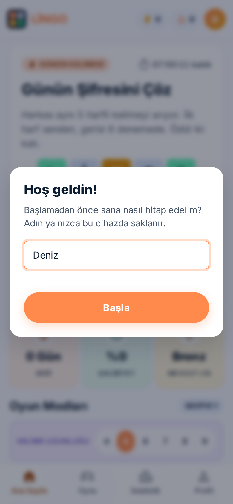 İlk açılışta oyuncu adı</td>
    <td align="center" width="33%"> Ana sayfa ve günün kelimesi</td>
    <td align="center" width="33%">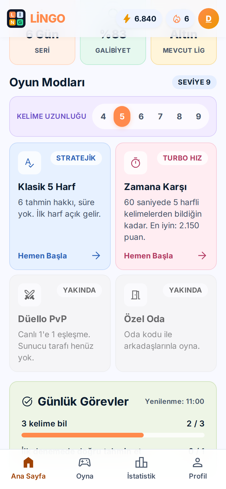 Kelime uzunluğu ve oyun modları</td>
  </tr>
  <tr>
    <td align="center" width="33%"> 5 harfli oyun, üçüncü tahmin</td>
    <td align="center" width="33%">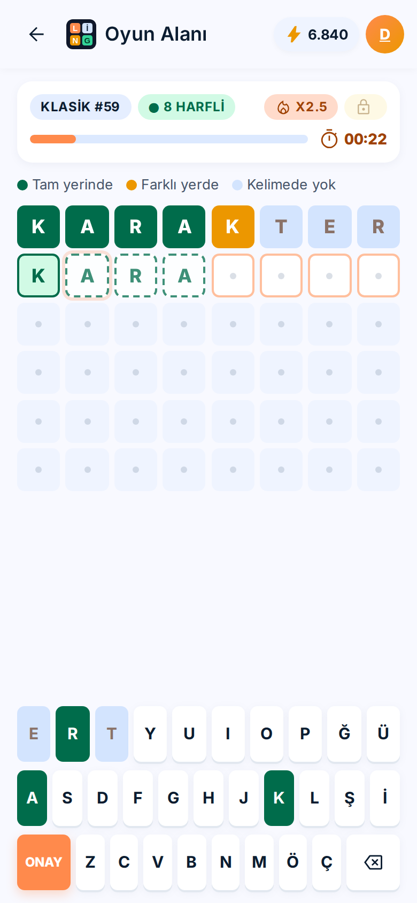 8 harfli tahta</td>
    <td align="center" width="33%">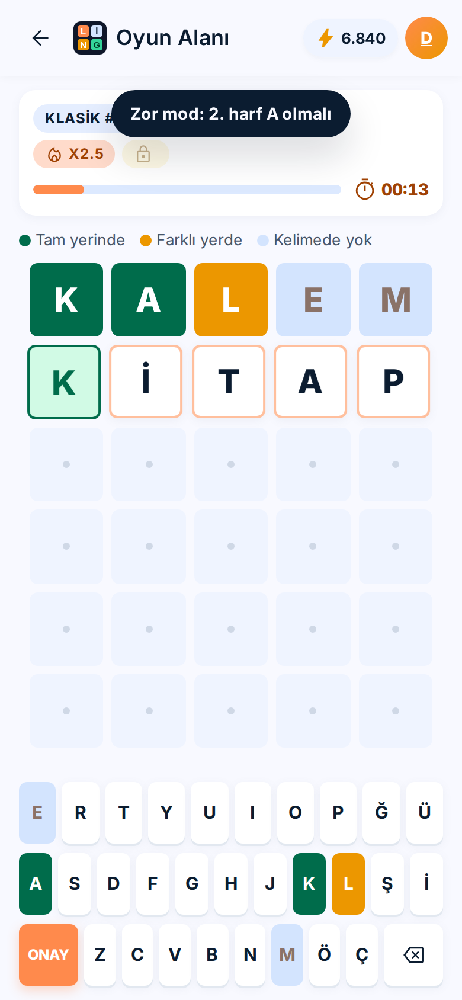 Zor mod uyarısı</td>
  </tr>
  <tr>
    <td align="center" width="33%">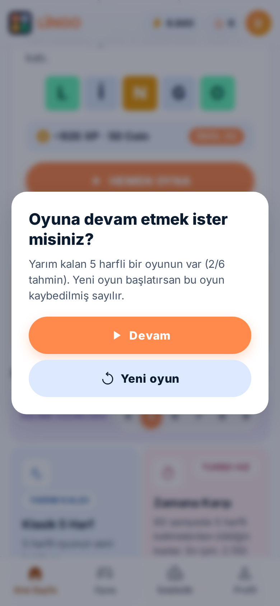 Yarım kalan oyuna devam</td>
    <td align="center" width="33%"> Kazanma ve kelimenin anlamı</td>
    <td align="center" width="33%">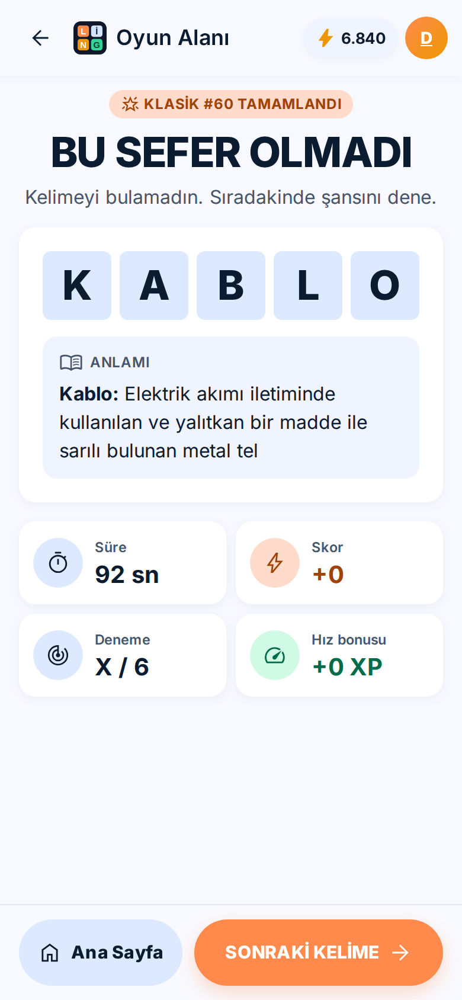 Kaybetme ekranı</td>
  </tr>
  <tr>
    <td align="center" width="33%">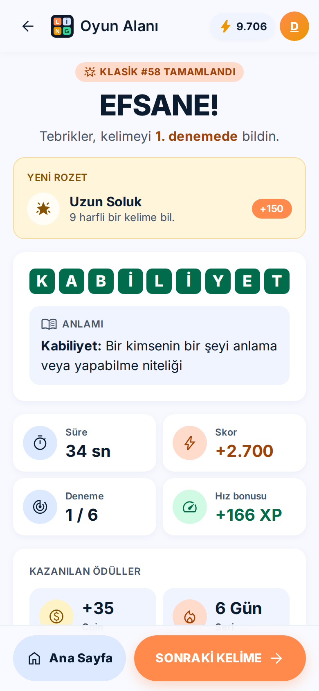 Yeni rozet kazanma</td>
    <td align="center" width="33%">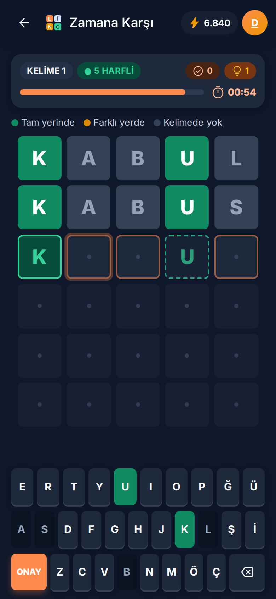 Zamana Karşı, koyu tema</td>
    <td align="center" width="33%">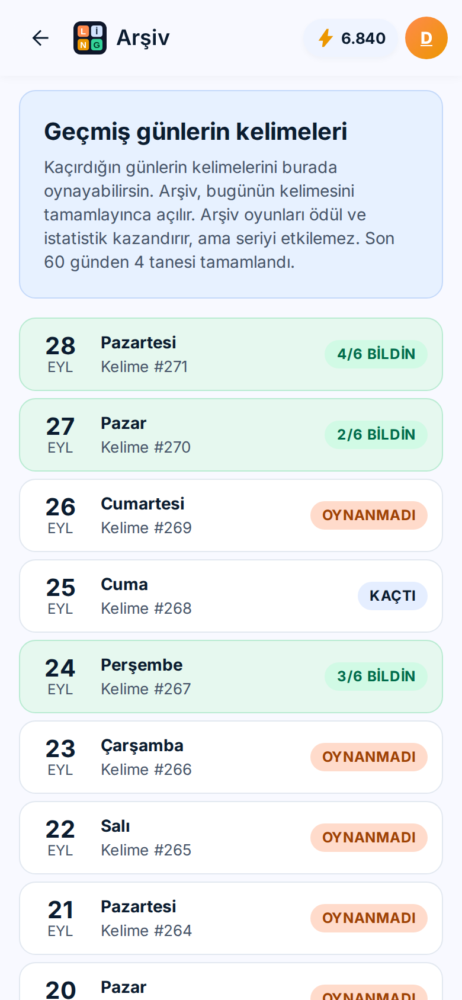 Geçmiş günlerin kelimeleri</td>
  </tr>
  <tr>
    <td align="center" width="33%">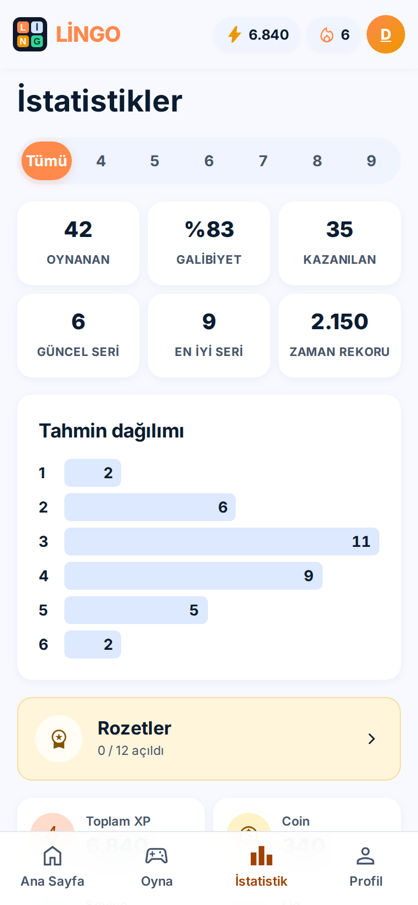 İstatistikler</td>
    <td align="center" width="33%">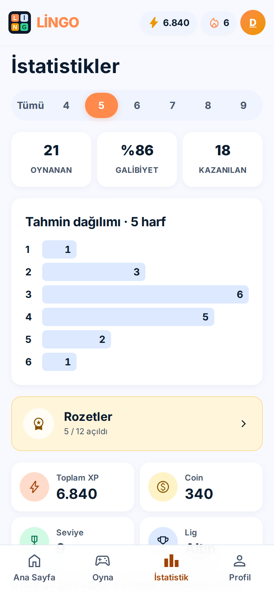 Uzunluğa göre istatistik</td>
    <td align="center" width="33%">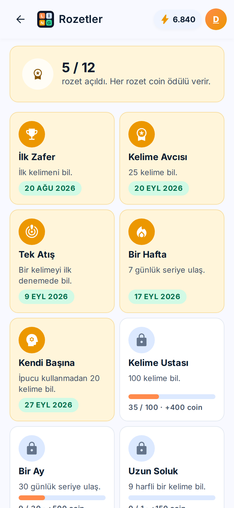 Rozetler</td>
  </tr>
  <tr>
    <td align="center" width="33%">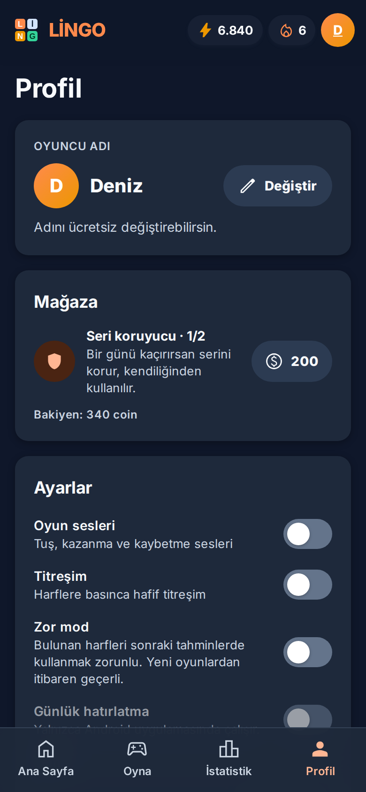 Profil, mağaza ve ayarlar</td>
    <td></td>
    <td></td>
  </tr>
</table>

## Kaynaklar

| Kaynak | Ne için kullanıldı | Lisans |
| --- | --- | --- |
| [TDK Güncel Türkçe Sözlük](https://sozluk.gov.tr/), 12. baskı ([ogun/guncel-turkce-sozluk](https://github.com/ogun/guncel-turkce-sozluk) dökümü) | Geçerli kelime listesi (yalnızca kelimelerin kendisi) | Sözlük içeriği TDK'ya aittir |
| [KeNet, Türkçe WordNet](https://github.com/StarlangSoftware/TurkishWordNet) (Işık Üniversitesi) | Kelime anlamları | GPL-3.0 |
| [an-array-of-turkish-words](https://github.com/hexapode/an-array-of-turkish-words) | Kelimelerin ne kadar yaygın olduğunu ölçmek | MIT |
| Google Stitch tasarımı ve Pastel Word Game System | Arayüz tasarımı (`design/`, `DESIGN.md`) | |
| [Inter](https://rsms.me/inter/) | Yazı tipi | OFL-1.1 |
| [Material Symbols](https://fonts.google.com/icons) | Simgeler | Apache-2.0 |
| [Capacitor](https://capacitorjs.com/) | Android uygulaması olarak paketleme | MIT |

## Açık kaynak

Lingo açık kaynaklıdır ve [MIT lisansı](LICENSE) ile dağıtılır. Kodu indirebilir, değiştirebilir, kendi sürümünü yayımlayabilir ya da başka projelerde kullanabilirsin. Tek koşul, lisans metnini ve telif satırını korumak.

Kelime anlamları dosyaları KeNet'ten geldiği için GPL-3.0 lisansına tabidir; bu dosyaları değiştirip dağıtırsan onları da aynı lisansla paylaşman gerekir.

Hata bildirimleri, yeni kelime önerileri ve katkılar memnuniyetle karşılanır. Projeyi çalıştırmak, kelime listelerini yeniden üretmek ve Android sürümünü derlemek için gereken her şey [geliştirici notlarında](docs/GELISTIRME.md) anlatılıyor.
